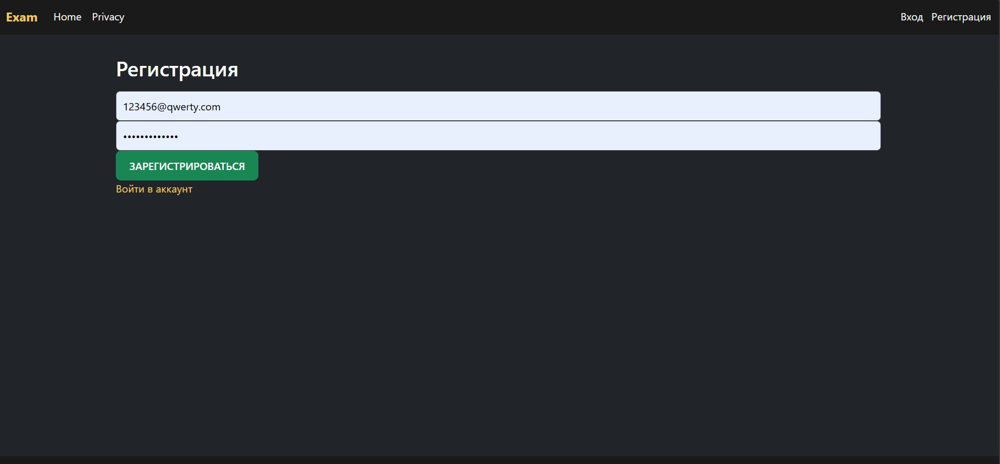

# 🚗 Car Shop — ASP.NET Core MVC Web Store

A modern, fully functional e-commerce website for selling cars, built with **ASP.NET Core MVC**, **Entity Framework Core**, and **ASP.NET Core Identity**.

This project was developed as a graduation assignment and demonstrates my understanding of building real-world web applications — including user authentication, database design, product filtering, shopping cart logic, and order management.

---

## ✨ Key Features

- 🧾 **Authentication** – User registration and login via ASP.NET Identity, with role management and Russian error localization.
- 🚙 **Vehicle Catalog** – Browse and filter cars by category; includes brand, model, price, and mileage info.
- 🛒 **Shopping Cart** – Add/remove vehicles, track quantity, and clear cart contents.
- 📦 **Checkout System** – Submit order via form; system updates vehicle status (`Sold` / `Available`) and stores order in the database.
- 👤 **User Profile** – View personal data and order history (available only to authenticated users).
- 💾 **EF Core Integration** – Code-first migrations, entity relationships, and LINQ queries.
- 📱 **Responsive Design** – Clean Bootstrap-based layout with modals and validation messages.

---

## 🖼️ Screenshots

| Catalog | Checkout | Login | Profile |
|---------|----------|-------|---------|
|  |  |  |  |


---

## 🗃️ Project Structure

```
/Models         → Vehicle.cs, Order.cs, Category.cs, etc.
├── /Controllers → VehicleController.cs, AccountController.cs, ...
├── /Views       → Razor Views: Account, Vehicle, Order, Profile
├── /Services    → CartService.cs, OrderService.cs
└── /Data        → ApplicationDbContext.cs (EF Core + Identity)
```

---

## 🧠 Lessons Learned

Through this project, I gained experience in:
- Using **ASP.NET Core Identity** for secure authentication and role management.
- Working with **Entity Framework Core** for database design and migrations.
- Creating a **modular MVC architecture** and managing user-friendly UI/UX features.
- Handling real-world challenges like cart logic, form validation, and data consistency.

---

## 🚀 Planned Improvements

- ✅ Client- and server-side form validation.
- ✉️ Email notifications for order confirmations.
- 🛠️ Admin dashboard to manage users, cars, and orders.
- 💳 Integration with Fast Payment System (SBP) for real transactions.

---

## 🧰 Tech Stack

- **ASP.NET Core MVC 8**  
- **Entity Framework Core** (Code-First)  
- **ASP.NET Core Identity**  
- **SQL Server**  
- **Bootstrap 5**  
- **LINQ**

---

## 📎 License

Free to use for learning and personal development purposes.

---

Made with ❤️ by **SaySubr**